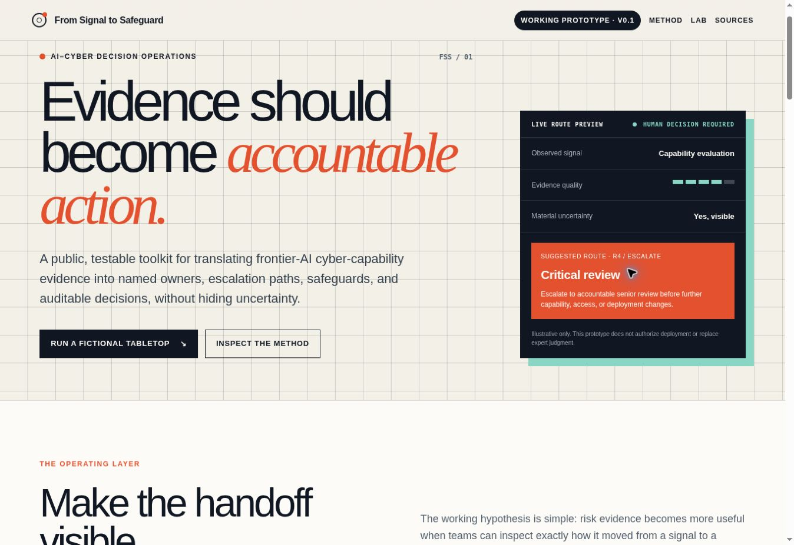
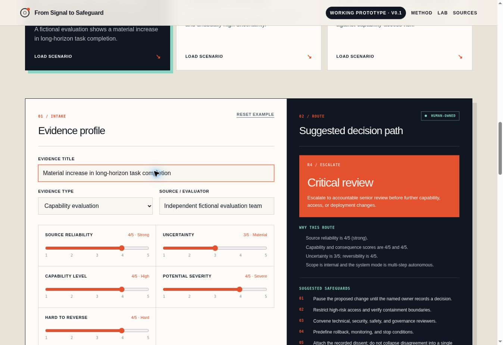
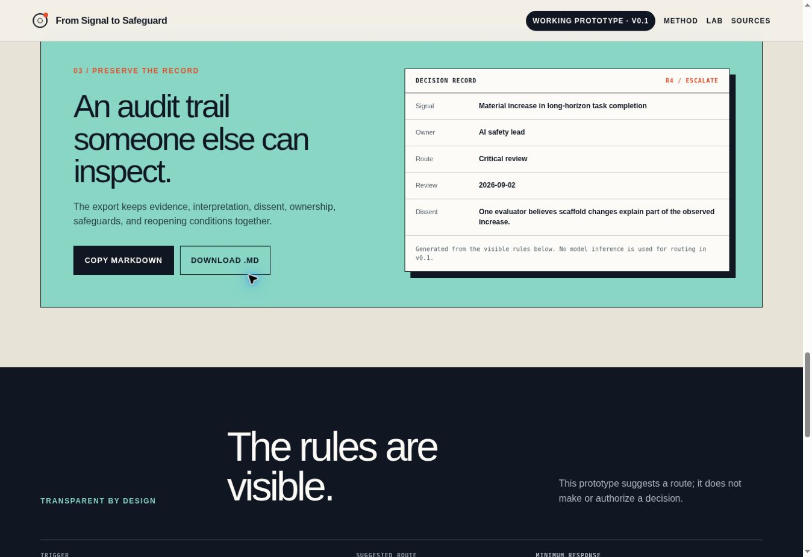

# From Signal to Safeguard

**A public AI-cyber governance prototype for translating risk evidence into accountable human decisions.**

[Launch the live prototype](https://from-signal-to-safeguard.imani-kirika116.chatgpt.site/) | [Read the project brief](docs/PROJECT_BRIEF.md) | [Review the methodology](docs/METHODOLOGY.md) | [See the roadmap](ROADMAP.md)



## Overview

From Signal to Safeguard is a public, testable decision-operations prototype for frontier-AI cyber-risk governance. It explores how evaluation evidence can be translated into:

- explicit evidence-quality and uncertainty assessments;
- transparent escalation thresholds;
- named human decision owners;
- safeguards, restrictions, and review conditions;
- recorded dissent and unresolved uncertainty;
- auditable Markdown decision records.

The prototype uses fictional, non-operational scenarios. It does not authorize deployments, assess live systems, provide exploit instructions, or replace expert judgment.

## The problem

Risk frameworks and capability evaluations can identify concerning evidence, but evidence affects outcomes only when an institution translates it into a timely, reviewable decision.

This project tests a narrow question:

> How can public frontier-AI cyber-risk frameworks and evaluation evidence be translated into a practical, auditable decision workflow without concealing uncertainty or creating a false sense of safety?

## What v0.1 does

The working prototype lets a user:

1. Load one of three fictional AI-cyber tabletop scenarios.
2. Record the observed evidence separately from its interpretation.
3. Score source reliability, uncertainty, capability, severity, reversibility, scope, and system autonomy.
4. Inspect a deterministic routing recommendation and the rules that produced it.
5. Assign a human decision owner and review date.
6. Preserve dissent, suggested safeguards, and conditions that would reopen the decision.
7. Copy or download an auditable decision record in Markdown.



## Decision routes

The v0.1 engine uses visible rules rather than hidden model inference.

| Trigger | Suggested route | Minimum response |
|---|---|---|
| Uncertainty at 4 or 5, or reliability at 1 or 2 | Evidence hold | Independent check and no consequential expansion |
| High capability and high severity, critical scope, or autonomous high-severity signal | Critical review | Pause, restrict, and escalate to the named owner |
| Moderate capability and severity, external scope, or hard reversibility | Elevated review | Bounded pilot, monitoring, and rollback conditions |
| Below the above thresholds | Monitor with trigger | Preserve the record and define reopening conditions |

These routes are suggestions for structured review. A human remains responsible for every consequential decision.

## Prototype scenarios

- **Autonomous cyber-range jump:** A fictional evaluation shows a material increase in long-horizon task completion.
- **Evaluation anomaly:** A fictional test produces conflicting evidence and unusually high uncertainty.
- **Defensive access expansion:** A fictional proposal weighs defensive utility against capability-access risk.

## Auditable output

The export keeps the signal, owner, route, review date, dissent, safeguards, and reopening conditions together. The interface generates the record from the same visible routing rules shown to the user.



## Safety boundaries

The prototype will not:

- develop offensive cyber capabilities or provide exploit instructions;
- test models against live systems or handle undisclosed vulnerabilities;
- claim to replace formal evaluation, regulatory authority, or expert judgment;
- collect sensitive security, proprietary, or personal information;
- promise that procedural consistency can eliminate catastrophic risk.

See [Safety Boundaries](docs/SAFETY_BOUNDARIES.md) for the full scope and limitations.

## Research foundations

The starting source set includes public work from:

- [UK AI Security Institute](https://www.aisi.gov.uk/frontier-ai-trends-report)
- [NIST Center for AI Standards and Innovation](https://www.nist.gov/caisi)
- [NIST AI Risk Management Framework](https://www.nist.gov/itl/ai-risk-management-framework)
- [Anthropic Responsible Scaling Policy](https://www.anthropic.com/responsible-scaling-policy)
- [OpenAI Preparedness Framework](https://openai.com/index/updating-our-preparedness-framework/)

The current interface is a research prototype, not a completed crosswalk or validated institutional standard. Primary-source mapping and practitioner review are part of the proposed pilot.

## Related work: AbundanceApp

[AbundanceApp](https://github.com/Iamlegend-Imani/AbundanceApp) is a separate resource-discovery project. It is not presented as AI-cyber safety work.

The connection is methodological. AbundanceApp structures source provenance, verification dates, eligibility language, expiration logic, and human review around opportunity information. From Signal to Safeguard applies a similar systems-building discipline to uncertain AI-cyber risk evidence, escalation, safeguards, and human accountability.

Together, the projects demonstrate a consistent practice: making evidence quality, decision criteria, ownership, exceptions, and review conditions visible.

## Project status

**Current release:** v0.1 working prototype, August 2026

Completed:

- responsive public interface;
- three fictional tabletop presets;
- deterministic decision-routing logic;
- evidence, uncertainty, ownership, and dissent fields;
- auditable Markdown record generation;
- explicit safety boundaries and starting-source links.

Planned work depends on funding, practitioner participation, and what the evidence supports. See the [roadmap](ROADMAP.md).

## Run locally

Prerequisites:

- Node.js 22.13 or newer
- npm

```bash
git clone https://github.com/Iamlegend-Imani/from-signal-to-safeguard.git
cd from-signal-to-safeguard
npm ci
npm run dev
```

For a production build:

```bash
npm run build
```

## Repository structure

```text
app/                         Interactive prototype and styles
docs/                        Brief, methodology, safety boundaries, and images
public/                      Public assets
scripts/                     Build and validation helpers
worker/                      Cloudflare-compatible worker entry point
ROADMAP.md                   Proposed research and product milestones
CITATION.cff                 Citation metadata
```

## Author

**Imani-Faith Kirika**  
Systems builder working across AI, data, operations, customer experience, and cybersecurity.

## License

Released under the [MIT License](LICENSE). The methodology remains experimental and should not be treated as an assurance, certification, or operational authorization standard.
